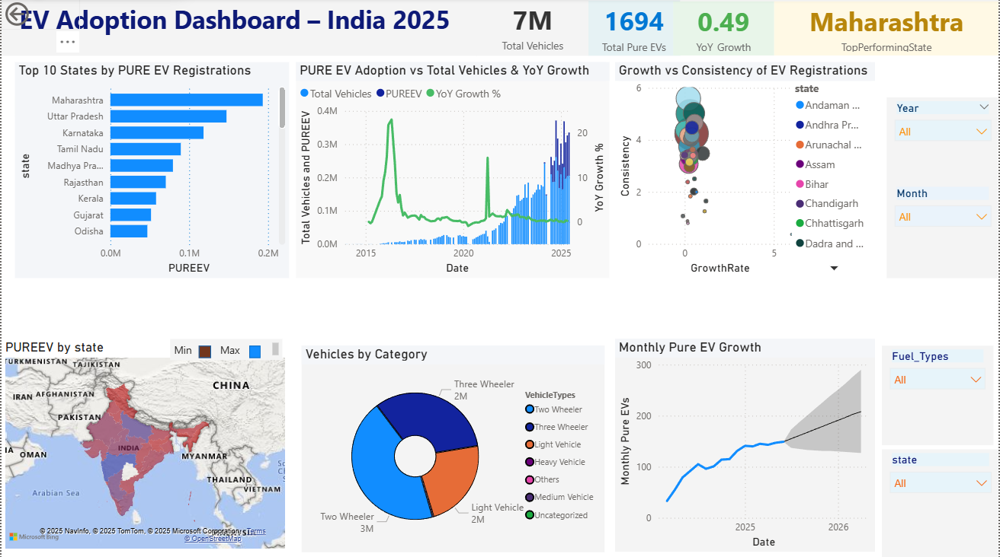

#  Powering the Shift: EV Adoption Trends Across India (2014–2025)

Have you ever wondered what India’s roads will look like without petrol or diesel?  
This Power BI project explores how **Electric Vehicles (EVs)** are growing across India, using real data and interactive visuals.  
It highlights state-level adoption, year-over-year growth, fuel type comparisons, and the future outlook of EV adoption.  

---

## Dashboard Preview
<p align="center">
  
</p>

---

##  Dataset Overview
- **Source**: Ministry of Road Transport and Highways (2014–2025)  
- **Granularity**: State / UT level  
- **Fields**:  
  - Year & Month  
  - State/UT  
  - Vehicle Category (Two-wheelers, Cars, Buses, etc.)  
  - Fuel Type (Pure EV, Plug-in Hybrid, Strong Hybrid, Diesel/Hybrid, Petrol/Hybrid, Fuel Cell Hydrogen)  
  - Registrations (absolute numbers)  

---

## Project Objectives
- Visualize **EV adoption growth** across India (2014–2025).  
- Compare **Pure EVs vs Hybrids** across vehicle categories.  
- Identify **top-performing states** vs lagging regions.  
- Track **YoY growth, adoption share, and anomalies**.  
- Provide insights to **policymakers, businesses, and infrastructure planners** via an interactive Power BI dashboard.  

---

## Key Insights
 **National EV Adoption is Accelerating** – Clear upward trend after 2019 due to policies & awareness.  
 **Pure EVs Lead the Market** – Steady dominance over hybrids & plug-in hybrids.  
 **Top States** – Maharashtra, UP, Karnataka, and Tamil Nadu drive most adoption.  
 **Regional Gaps Exist** – NE states, UTs, and Islands lag behind.  
 **Seasonal Patterns** – Policy rollouts and launches trigger adoption spikes.  

---

## Visual Highlights
- **Top 10 States by EV Adoption**  
- **YoY Growth Trends**  
- **EV Distribution Map (State-level)**  
- **Vehicle Category Mix (2W, 3W, LMV, etc.)**  
- **Monthly Pure EV Growth**  

*(See all visuals in [`visuals/`](./visuals))*  

---

## Repository Structure
```plaintext
EV-Adoption-Trends-India/
│── data/
│   ├── raw/              # Original dataset (CSV)
│
│── reports/
│   ├── EV_Adoption_India.pbix  # Power BI project file
│   ├── EV_Adoption_India.pdf   # Exported dashboard report
│
│── visuals/              # Dashboard screenshots, banner images
│   ├── banner.png
│   ├── dashboard_main.png
│   ├── state_wise_map.png
│   ├── yoy_growth.png
│   ├── vehicle_category_breakdown.png
│── README.md             # Main project documentation
│ ── LICENSE


